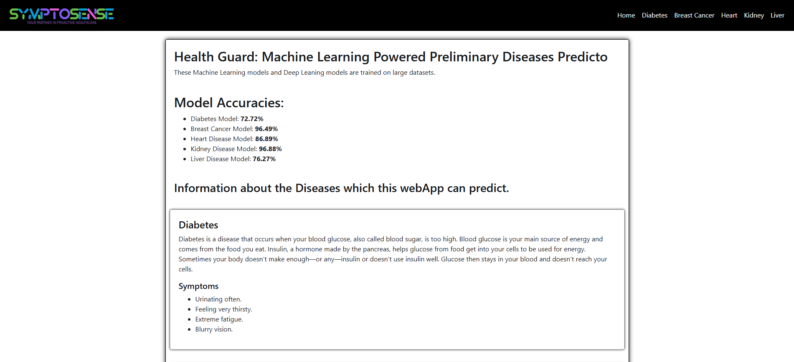
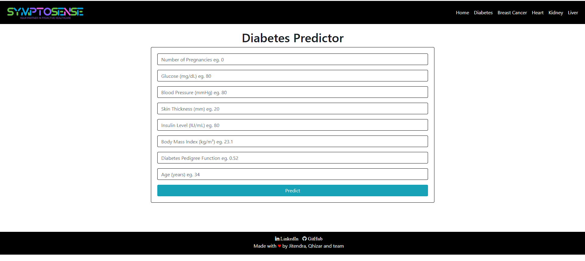

# Multi-Disease Prediction Web Application

This Flask-based web application serves as a comprehensive medical diagnosis tool, utilizing machine learning models to predict various diseases based on user-input medical data and images.

The application integrates multiple pre-trained models to predict the likelihood of diabetes, breast cancer, heart disease, kidney disease, liver disease, malaria, and pneumonia. It provides an intuitive interface for users to input their medical data or upload relevant images, and receive instant predictions based on state-of-the-art machine learning algorithms.

## 📸 Screenshots  
### 1. Home Page  
  

### 2. Prediction Result  
  

## Repository Structure

```
.
├── app.py
├── README.md
└── templates
    ├── breast_cancer.html
    ├── diabetes.html
    ├── heart.html
    ├── home.html
    ├── kidney.html
    ├── liver.html
    ├── main.html  
    └── predict.html
```

- `app.py`: The main Flask application file containing all route definitions and prediction logic.
- `templates/`: Directory containing HTML templates for each disease prediction page and results.

## Usage Instructions

### Installation

1. Ensure you have Python 3.7+ installed.
2. Clone the repository to your local machine.
3. Navigate to the project directory.
4. Install the required dependencies:

```bash
pip install flask pillow numpy tensorflow
```

### Getting Started

1. Run the Flask application:

```bash
python app.py
```

2. Open a web browser and navigate to `http://localhost:5000`.

3. Use the home page to select the disease you want to predict.

4. Input the required medical data or upload an image as prompted.

5. Submit the form to receive the prediction result.

### Configuration

The application uses pre-trained models stored in a `models/` directory (not shown in the repository structure). Ensure that the following model files are present:

- `models/diabetes.pkl`
- `models/breast_cancer.pkl`
- `models/heart.pkl`
- `models/kidney.pkl`
- `models/liver.pkl`

### Common Use Cases

1. Diabetes Prediction:
   - Navigate to the diabetes prediction page.
   - Input the required medical data (8 parameters).
   - Submit the form to receive the prediction.

2. Malaria Prediction:
   - Go to the malaria prediction page.
   - Upload an image of a blood smear.
   - Submit to get the prediction result.

### Troubleshooting

- If you encounter a "Please enter valid Data" message:
  - Ensure all input fields are filled with appropriate numerical values.
  - Check for any non-numeric characters in the input fields.

- If you see a "Please upload an Image" message for malaria or pneumonia prediction:
  - Verify that you have selected an image file before submitting.
  - Ensure the image file is in a supported format (e.g., JPEG, PNG).

- Debug Mode:
  - The application runs in debug mode by default.
  - Check the console output for detailed error messages and stack traces.

## Data Flow

The application follows a straightforward request-response flow:

1. User selects a disease prediction option from the home page.
2. The corresponding HTML template is rendered, prompting for input.
3. User submits the form with medical data or an uploaded image.
4. The Flask backend processes the input:
   - For text-based input: Data is converted to a list and passed to the `predict()` function.
   - For image input: The image is preprocessed and passed to the appropriate deep learning model.
5. The prediction result is generated using the pre-trained model.
6. The result is rendered on a prediction result page and displayed to the user.

```
[User] -> [Home Page] -> [Disease-Specific Input Page] -> [Form Submission]
    -> [Flask Backend] -> [Data Preprocessing] -> [ML Model Prediction]
    -> [Result Processing] -> [Prediction Result Page] -> [User]
```

Note: The application uses separate routes and prediction logic for each disease, allowing for modularity and easy expansion of the system to include additional diseases in the future.